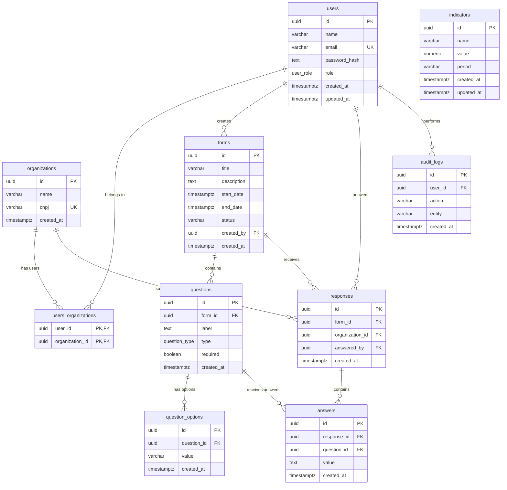

# Entity Relationship Diagram (ERD)
## Ágora Tech Park Indicators Database

### Mermaid Diagram

### Table Relationships

1. **users ↔ organizations** (Many-to-Many via users_organizations)
   - A user can belong to multiple organizations
   - An organization can have multiple users

2. **users → forms** (One-to-Many)
   - A user can create multiple forms
   - A form is created by one user

3. **users → responses** (One-to-Many)
   - A user can submit multiple responses
   - A response is submitted by one user

4. **organizations → responses** (One-to-Many)
   - An organization can submit multiple responses
   - A response belongs to one organization

5. **forms → questions** (One-to-Many)
   - A form can have multiple questions
   - A question belongs to one form

6. **forms → responses** (One-to-Many)
   - A form can receive multiple responses
   - A response belongs to one form

7. **questions → question_options** (One-to-Many)
   - A question can have multiple options (for OPTION type)
   - An option belongs to one question

8. **questions → answers** (One-to-Many)
   - A question can receive multiple answers (across different responses)
   - An answer belongs to one question

9. **responses → answers** (One-to-Many)
   - A response can have multiple answers
   - An answer belongs to one response

10. **users → audit_logs** (One-to-Many)
    - A user can perform multiple actions
    - An audit log is associated with one user (can be NULL if user deleted)

### Enums

**user_role**: ADMIN, PESQUISADOR, GESTOR, RESIDENTE

**question_type**: TEXT, NUMBER, DECIMAL, OPTION

**form_status**: DRAFT, ACTIVE, CLOSED

### Constraints

- **Unique constraints**: users.email, organizations.cnpj, indicators (name, period)
- **Foreign key constraints**: All relationships are enforced with ON DELETE CASCADE or SET NULL
- **Check constraints**: forms.end_date >= forms.start_date, forms.status in allowed values
- **Composite primary key**: users_organizations (user_id, organization_id)
- **Unique constraints**: responses (form_id, organization_id), answers (response_id, question_id)

### Indexes

Performance indexes created on:
- users: email, role
- organizations: cnpj
- forms: status, created_by
- questions: form_id
- question_options: question_id
- responses: form_id, organization_id, answered_by
- answers: response_id, question_id
- indicators: period
- audit_logs: user_id, created_at

### Triggers

- **update_users_updated_at**: Automatically updates the updated_at column on users table when a row is updated
- **update_indicators_updated_at**: Automatically updates the updated_at column on indicators table when a row is updated
