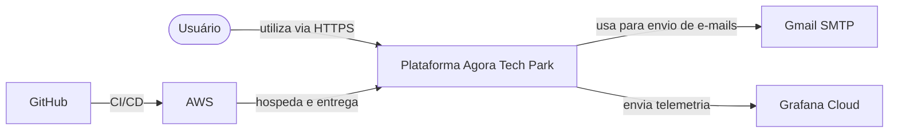
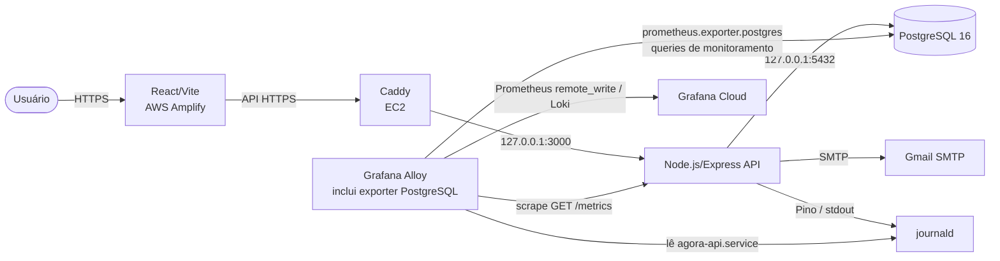
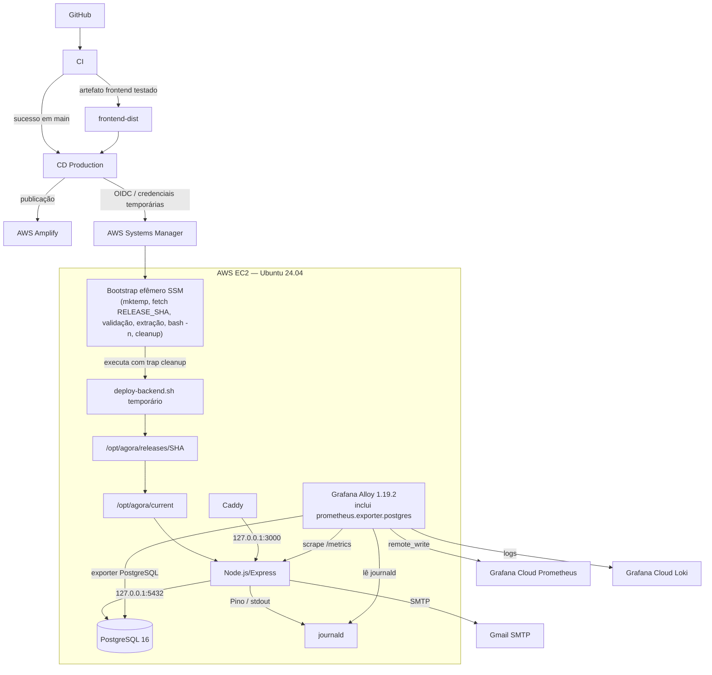

# Arquitetura

## Visão geral

Em 18/09/2026, a arquitetura validada separa o frontend React/Vite no AWS Amplify do backend Node.js/Express em uma EC2 Ubuntu 24.04. A URL pública do frontend vem da variável GitHub `PRODUCTION_FRONTEND_URL` e não está versionada. A API pública é `https://agora-techpark.duckdns.org/api`, com health em `https://agora-techpark.duckdns.org/api/health`.

Na EC2, Caddy termina HTTPS e encaminha requisições para a API em `127.0.0.1:3000`. A API é gerenciada por `agora-api.service`; Caddy por `caddy.service`; PostgreSQL 16 por `postgresql.service`; e Grafana Alloy 1.19.2 por `alloy.service`. Os quatro serviços foram comprovados como `active` e `enabled`.

PostgreSQL escuta somente em `127.0.0.1:5432`, na mesma EC2. Produção usa o serviço externo Gmail SMTP via Nodemailer, enquanto DEV/test usam um provider mock controlado sem SMTP externo. O Grafana Cloud também é externo; Grafana não é operado na EC2. RDS e SES não fazem parte da arquitetura vigente.

O backend mantém o fluxo `routes → controllers → services → repositories`: regras de negócio ficam nos services, SQL parametrizado nos repositories, controllers traduzem HTTP e middlewares tratam autenticação, autorização, limites, logs, métricas e erros.

## Visão de contexto — equivalente ao C4 Context



O limite lógico “Plataforma Agora Tech Park” reúne a SPA e a API sem atribuir responsabilidades internas. Na implantação, esses componentes ficam em destinos distintos: frontend no Amplify e backend na EC2.

## Visão de containers — equivalente ao C4 Container



O Alloy faz o scrape local de `/metrics` com bearer token. O Caddyfile versionado responde 404 para qualquer acesso público a esse caminho antes do proxy.

## Visão de deployment



O GitHub Actions usa OIDC para assumir uma role e obter credenciais AWS temporárias; access keys fixas não fazem parte do fluxo. O CI executa antes do CD. O CI #43 aprovou lint/auditoria de dependências, testes unitários do backend, testes e build do frontend, integração PostgreSQL e SonarQube Cloud Quality Gate.

O CD Production #48 implantou o backend via Systems Manager, publicou no Amplify o artefato já testado pelo CI e concluiu os smoke tests. O backend usa releases imutáveis em `/opt/agora/releases/<sha>` e symlink ativo `/opt/agora/current`. O runtime de deploy não é persistente no host: a cada deploy ou rollback, o Systems Manager executa um bootstrap efêmero que cria diretório temporário (`mktemp -d`) com `trap cleanup`, busca estritamente o `RELEASE_SHA` exato de 40 caracteres com `git fetch --depth 1`, compara o commit resolvido ao SHA aprovado, extrai `deploy/aws/deploy-backend.sh` daquele commit, valida a sintaxe via `bash -n`, executa a cópia temporária e remove o diretório temporário ao término.

## Ambientes

| Ambiente | Aplicação | Banco | E-mail | Observabilidade |
| --- | --- | --- | --- | --- |
| development | React/Vite e Node locais; Compose quando aplicável | PostgreSQL local/Compose | provider mock por padrão, sem SMTP externo | Pino no console; métricas locais |
| test/CI | GitHub runner | PostgreSQL 16 isolado | provider mock obrigatório, sem SMTP externo | logs de teste |
| production | React/Vite no Amplify; Node/Express na EC2/systemd | PostgreSQL 16 local à EC2 | Gmail SMTP | journald + Alloy + Grafana Cloud |

Não há ambiente STAGING comprovado; ele não integra a arquitetura atual.

## Endpoints operacionais

- `GET /api/health/live`: liveness da API, sem dependências.
- `GET /api/health/ready`: readiness com PostgreSQL e o provider de e-mail ativo.
- `GET /api/health`: contrato agregado; banco indisponível retorna 503; em produção, SMTP indisponível retorna `degraded` com HTTP 200; em DEV/test, o mock saudável é reportado como `up`.
- `GET /metrics`: endpoint Prometheus da API.
  - acesso direto ao backend local em produção, sem bearer token ou com token incorreto: HTTP 404;
  - acesso direto ao backend local em produção, com bearer token correto: HTTP 200 e métricas no formato Prometheus em operação normal;
  - acesso direto em ambiente diferente de produção: o código não exige bearer token;
  - acesso público via Caddy: HTTP 404 antes do proxy, independentemente do bearer token.

O Alloy usa o bearer token no scrape local de `127.0.0.1:3000/metrics`.

Nenhum label de métrica deve conter nome, e-mail, identificador de usuário, conteúdo de formulário ou token.

## Observabilidade

Os fluxos validados em produção são:

```text
Node/Express /metrics → Grafana Alloy → Grafana Cloud Prometheus
Pino → stdout/journald → Grafana Alloy → Grafana Cloud Loki
PostgreSQL → Grafana Alloy (prometheus.exporter.postgres) → Grafana Cloud Prometheus
```

`prometheus.exporter.postgres` é um componente configurado e executado pelo Alloy, não um serviço systemd independente. O Grafana Cloud recebeu dados reais de Prometheus e Loki. Dashboards finais, disparo e recebimento de alertas, SLO e retenção ainda não foram validados.

## Migrações e backup

O deploy cria um `pg_dump` local antes das migrations, valida migrations com `migrate:dry` e aplica as pendentes antes de trocar o symlink da release e reiniciar a API. O backup permanece na mesma EC2; destino off-site e teste de restauração continuam pendentes.

Migrações antigas são imutáveis e verificadas por SHA-256 em `schema_migrations`. `migrate:dry` não altera dados e falha ao detectar banco legado, metadados legados ou checksum divergente. Bancos anteriores ao mecanismo precisam de `migrate:baseline`, com confirmação explícita. Cada migração pendente é transacional e existe um advisory lock contra concorrência.
